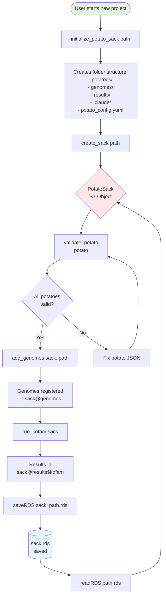
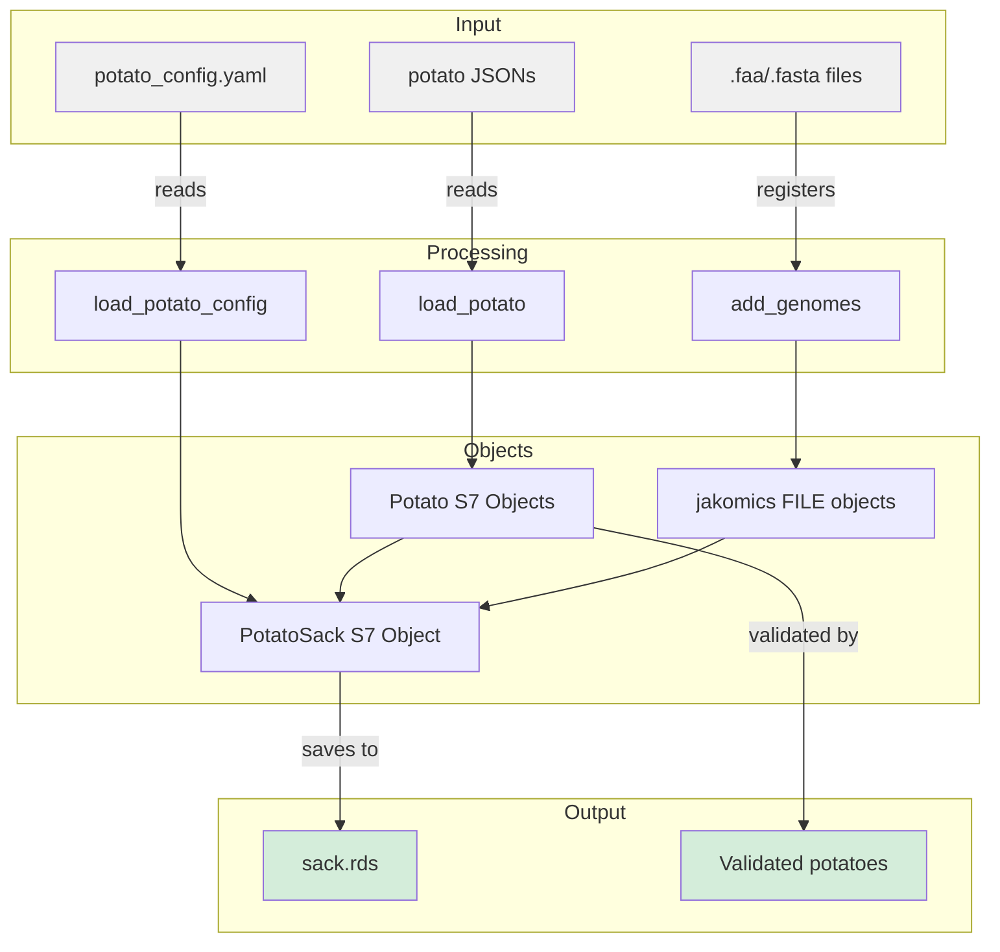
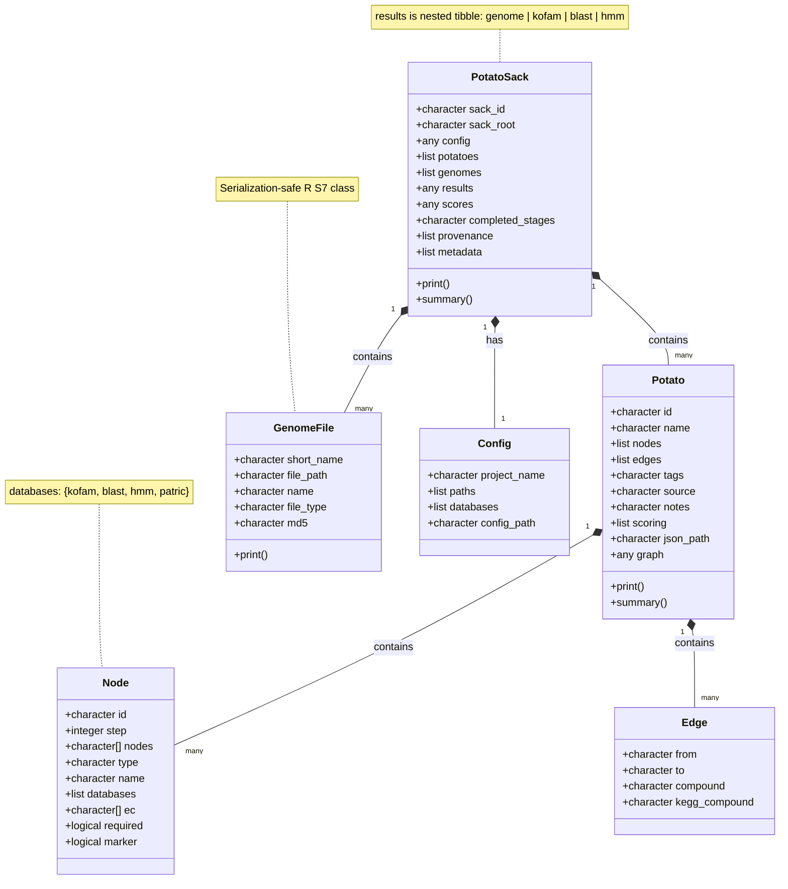
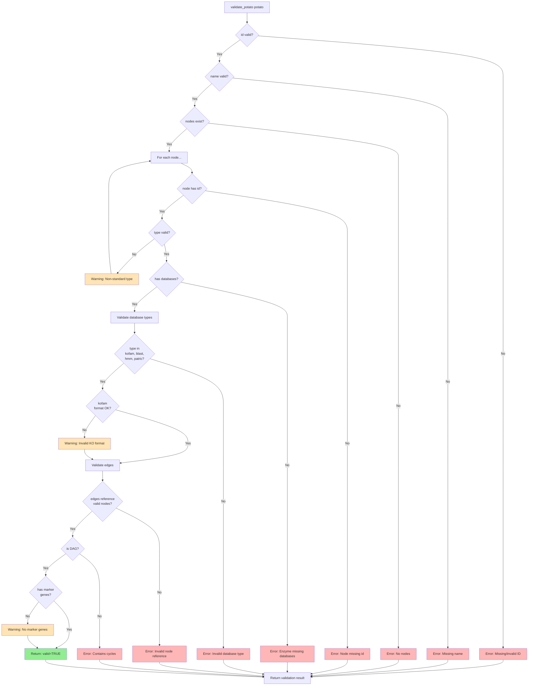
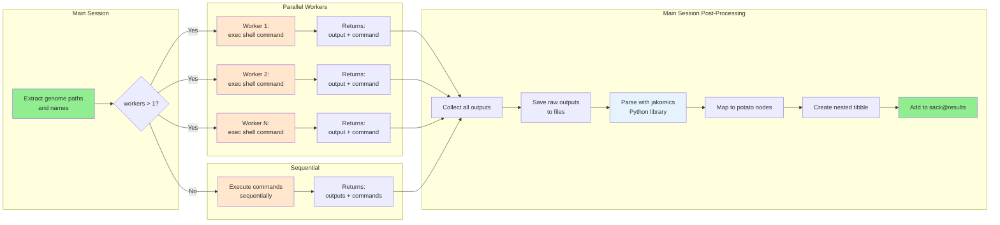

# POTATO v0.6.0 - Workflow Diagrams

Current status: Foundation complete. Kofam annotation fully implemented with parallel execution and file provenance.

## User Workflow



## Function Call Graph

```mermaid
flowchart LR
    subgraph User Functions
        A[initialize_potato_sack]
        B[create_sack]
        C[validate_potato]
        D[add_genomes]
    end
    
    subgraph Config
        F[load_potato_config]
        G[validate_database_configs]
        H[find_potato_sack]
    end
    
    subgraph Potato Loading
        I[load_potatoes]
        J[load_potato]
        K[load_test_potato]
    end
    
    subgraph Potato Helpers
        L[get_enzyme_nodes]
        M[get_detection_terms]
        N[get_marker_genes]
        O[build_potato_graph]
        P[print_validation]
    end
    
    subgraph Classes
        Q[Potato S7 Class]
        R[PotatoSack S7 Class]
    end
    
    A -->|creates| H
    B -->|searches with| H
    B -->|calls| F
    F -->|validates| G
    B -->|calls| I
    I -->|calls| J
    J -->|creates| Q
    B -->|creates| R
    
    C -->|validates| Q
    C -->|uses| L
    C -->|uses| O
    C -->|prints with| P
    
    D -->|uses jakomics| R
    
    L -->|extracts from| Q
    M -->|extracts from| Q
    N -->|extracts from| Q
    O -->|builds from| Q
    
    style A fill:#90EE90
    style B fill:#90EE90
    style C fill:#90EE90
    style D fill:#90EE90
    style Q fill:#FFB6C1
    style R fill:#FFB6C1
```



## Data Flow



## Class Structure



## Validation Flow



## Kofam Annotation Workflow

```mermaid
flowchart TD
    Start[run_kofam sack] --> CheckOverwrite{kofam results<br/>exist?}
    
    CheckOverwrite -->|Yes & overwrite=FALSE| Error[Error: Use overwrite=TRUE]
    CheckOverwrite -->|Yes & overwrite=TRUE| Delete[Delete sack@results$kofam]
    CheckOverwrite -->|No| CheckGenomes
    Delete --> CheckGenomes{genomes<br/>registered?}
    
    CheckGenomes -->|No| Error2[Error: Use add_genomes first]
    CheckGenomes -->|Yes| CreateHAL[create_kofam_hal]
    
    CreateHAL --> HAL[.hal file created<br/>in results/annotations/{timestamp}/]
    HAL --> ExtractInfo[Extract genome info:<br/>short_name, file_path]
    
    ExtractInfo --> CheckWorkers{workers > 1?}
    
    CheckWorkers -->|Yes| ParallelSetup[future::plan multisession]
    CheckWorkers -->|No| Sequential
    
    ParallelSetup --> ParallelExec[furrr::future_map<br/>with progressr]
    ParallelExec --> Workers[Workers execute:<br/>conda run -n {env} exec_annotation...]
    
    Workers --> RawOutputs[Collect raw outputs<br/>+ commands]
    
    Sequential[purrr::map<br/>with cli progress] --> WorkersSeq[Execute:<br/>conda run -n {env} exec_annotation...]
    WorkersSeq --> RawOutputs
    
    RawOutputs --> SaveFiles[Write files:<br/>{genome}.kofam.txt<br/>kofam.log]
    
    SaveFiles --> ParseSeq[Sequential parsing<br/>with jakomics.kegg]
    
    ParseSeq --> CleanLines[Strip leading * or space]
    CleanLines --> ParseKOFAM[kegg.KOFAM line parser]
    ParseKOFAM --> ParseHits[kegg.parse_kofam_hits]
    ParseHits --> MapPotatoes[kofam_hits_to_tibble]
    
    MapPotatoes --> NestedTibble[Create nested tibble:<br/>one per genome]
    NestedTibble --> AddResults[sack@results$kofam <- results]
    
    AddResults --> Return[Return modified sack]
    
    style Start fill:#90EE90
    style Return fill:#90EE90
    style Error fill:#FFB6B6
    style Error2 fill:#FFB6B6
    style HAL fill:#E6F3FF
    style Workers fill:#FFE6CC
    style WorkersSeq fill:#FFE6CC
    style NestedTibble fill:#E6F3FF
```

## Parallel Execution Pattern

Pattern used by all annotation tools (kofam, hmm, blast):



**Key Design Decisions:**
- Workers execute shell commands only (no Python serialization issues)
- Conda environment activated per-command: `conda run -n {env} {tool}`
- All parsing done sequentially after parallel execution completes
- GenomeFile S7 objects (not Python FILE objects) for serialization safety
- All outputs saved to timestamped directory for provenance
```
